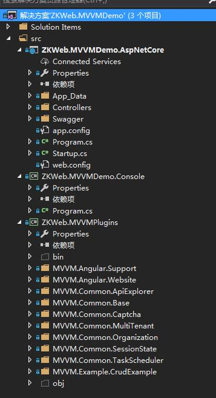
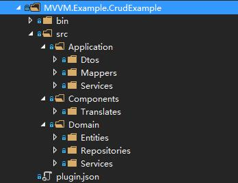
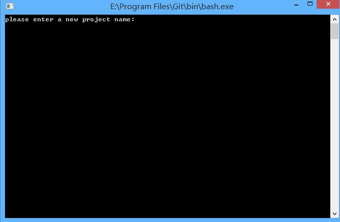

# 后端的项目结构

当你打开ZKWeb.MVVMDemo.sln，可以看到下面的结构



各个项目的作用如下

- ZKWeb.MVVMDemo.AspNetCore
  - Asp.Net Core的网站项目，只负责配置Asp.Net Core和启动网站，不保存业务代码
- ZKWeb.MVVMDemo.Console
  - 运行测试使用的控制台项目，也可以用于命令行编译所有插件
- ZKWeb.MVVMPlugins
  - 插件项目，包含业务代码的插件和前端网站的插件

其中ZKWeb.MVVMPlugins项目下的一个文件夹代表一个插件，插件的目录结构如下



- bin: 保存该插件编译出来的程序集文件
- src: 插件的源代码，发布时可以不保留
  - Application: 应用层的代码
    - Dtos: 保存数据传输对象的文件夹
    - Mappers: 保存AutoMapper配置的文件夹
    - Services: 保存Api服务的文件夹
  - Components: 组件的代码
    - Translates: 保存翻译的文件夹
  - Domain: 领域层的代码
    - Entities: 保存实体类的文件夹
    - Repositories: 保存仓储的文件夹
    - Services: 保存领域服务的文件夹，主要的业务代码会在这里编写
- plugin.json: 插件信息

插件信息的格式如下

``` json
{
    "Name": "Crud Example For MVVM",
    "Version": "1.0",
    "Description": "Provide crud example",
    "Dependencies": [ "MVVM.Common.Base", "MVVM.Common.Organization" ]
}
```

网站的配置集中在`App_Data\config.json`管理，格式如下

注意插件的定义顺序就是插件的加载顺序，如果顺序有误会导致网站启动失败

``` json
{
    "ORM": "EFCore",
    "Database": "SQLite",
    "ConnectionString": "Data Source={{App_Data}}/test.db;",
    "PluginDirectories": [
        "../ZKWeb.MVVMPlugins"
    ],
    "Plugins": [
        "MVVM.Common.Base",
        "MVVM.Common.ApiExplorer",
        "MVVM.Common.TaskScheduler",
        "MVVM.Common.MultiTenant",
        "MVVM.Common.SessionState",
        "MVVM.Common.Captcha",
        "MVVM.Common.Organization",
        "MVVM.Example.CrudExample",
        "MVVM.Angular.Support",
        "MVVM.Angular.Website"
    ]
}
```

更多的说明可以参考ZKWeb的官方文档:

- [网站结构](http://zkweb-framework.github.io/cn/site/core/website_struct/index.html)
- [配置文件](http://zkweb-framework.github.io/cn/site/core/website_config/index.html)
- [插件系统](http://zkweb-framework.github.io/cn/site/core/plugin/index.html)

前端的文件夹说明请参考后面的文档

如果你想把这个Demo变为自己的项目，可以使用重命名脚本`project_rename.sh`，
这个是shell文件需要安装git bash shell或者bash on windows 10执行，
运行后会让你填写一个新的项目名称，回车后文件名和命名空间会被批量替换


